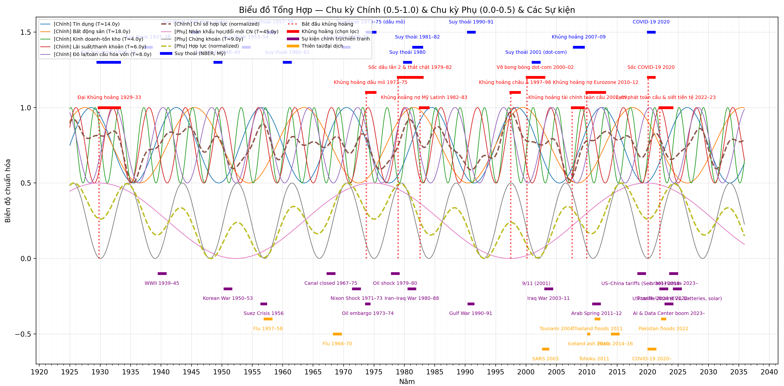
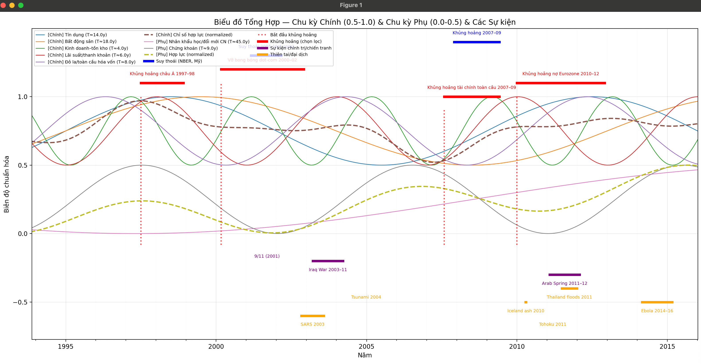
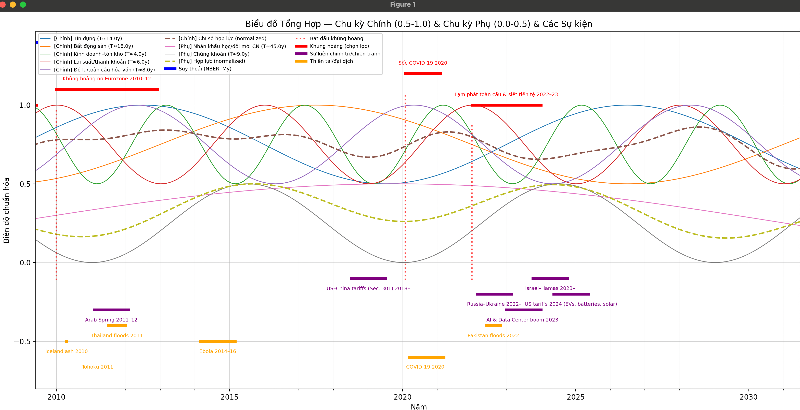

# Công Cụ Mô Phỏng và Phân Tích Chu Kỳ Khủng Hoảng Kinh Tế

## 🎯 Giới Thiệu

Đây là một công cụ phân tích và mô phỏng tiên tiến các chu kỳ khủng hoảng kinh tế, được phát triển để hiểu sâu về các nguyên nhân, quy luật và mô hình lặp lại của các cuộc khủng hoảng kinh tế trong lịch sử. Công cụ sử dụng Python để tạo ra biểu đồ trực quan hóa tổng hợp với phân chia vùng rõ ràng cho từng loại chu kỳ và sự kiện.

## ✨ Tính Năng Chính

- **📊 Mô phỏng 6 chu kỳ nguyên nhân chính** gây ra khủng hoảng kinh tế
- **📈 Hiển thị trực quan khoảng thời gian** của suy thoái và khủng hoảng
- **📅 Dữ liệu lịch sử đầy đủ** từ 1929 đến hiện tại
- **🔍 Tạo biểu đồ SVG** có thể phóng to và xem chi tiết
- **⚙️ Phân tích tổng hợp** các yếu tố tác động đồng thời
- **🔮 Dự báo xu hướng** dựa trên các chu kỳ lịch sử

## 📈 Các Chu Kỳ Được Phân Tích

### Chu Kỳ Chính (Primary Cycles)

| Chu Kỳ | Thời Gian (năm) | Trọng Số | Mô Tả |
|---------|-----------------|----------|-------|
| 🏦 **Tín dụng** | 14.0 | 1.00 | Chu kỳ cho vay và tín dụng ngân hàng |
| 🏠 **Bất động sản** | 18.0 | 0.90 | Chu kỳ thị trường nhà đất |
| 📈 **Kinh doanh–tồn kho** | 4.0 | 0.55 | Chu kỳ kinh doanh và quản lý tồn kho |
| 💰 **Lãi suất/thanh khoản** | 6.0 | 0.80 | Chu kỳ chính sách tiền tệ |
| 🌍 **Đô la/toàn cầu hóa vốn** | 8.0 | 0.70 | Chu kỳ đồng đô la và dòng vốn |


### Chu Kỳ Phụ (Secondary Cycles)

| Chu Kỳ | Thời Gian (năm) | Trọng Số | Mô Tả |
|---------|-----------------|----------|-------|
| 👥 **Nhân khẩu học/đổi mới CN** | 45.0 | 0.65 | Chu kỳ dân số và cách mạng công nghiệp |
| 📊 **Chứng khoán** | 9.0 | 0.60 | Chu kỳ thị trường chứng khoán |

## 🛠️ Cài Đặt và Sử Dụng

### Yêu Cầu Hệ Thống
- **Python**: 3.7 trở lên
- **pip3**: Trình quản lý gói Python

### Cài Đặt Dependencies

```bash
pip3 install -r requirements.txt
```

### Chạy Công Cụ

```bash
python3 generate_graph.py
```

### Dependencies

```
numpy>=1.21.0      # Tính toán số học và mảng
pandas>=1.3.0      # Thao tác dữ liệu và chuỗi thời gian
matplotlib>=3.5.0  # Vẽ biểu đồ và trực quan hóa
```

## 📈 Dữ Liệu Đầu Vào

### 1. Suy Thoái (NBER, Mỹ) - 15 giai đoạn

| Thời Gian | Tên Suy Thoái |
|-----------|---------------|
| 1929-08 → 1933-03 | Đại Suy thoái 1929–33 |
| 1937-05 → 1938-06 | Suy thoái 1937–38 |
| 1945-02 → 1945-10 | Suy thoái 1945 (hậu chiến) |
| 1948-11 → 1949-10 | Suy thoái 1948–49 |
| 1953-07 → 1954-05 | Suy thoái 1953–54 |
| 1957-08 → 1958-04 | Suy thoái 1957–58 |
| 1960-04 → 1961-02 | Suy thoái 1960–61 |
| 1969-12 → 1970-11 | Suy thoái 1969–70 |
| 1973-11 → 1975-03 | Suy thoái 1973–75 (dầu mỏ) |
| 1980-01 → 1980-07 | Suy thoái 1980 |
| 1981-07 → 1982-11 | Suy thoái 1981–82 |
| 1990-07 → 1991-03 | Suy thoái 1990–91 |
| 2001-03 → 2001-11 | Suy thoái 2001 (dot-com) |
| 2007-12 → 2009-06 | Khủng hoảng 2007–09 |
| 2020-02 → 2020-04 | COVID-19 2020 |

### 2. Khủng Hoảng Lớn - 10 giai đoạn

| Thời Gian | Tên Khủng Hoảng |
|-----------|-----------------|
| 1929-10 → 1933-03 | Đại Khủng hoảng 1929–33 |
| 1973-10 → 1975-03 | Khủng hoảng dầu mỏ 1973–75 |
| 2007-08 → 2009-06 | Khủng hoảng tài chính toàn cầu 2007–09 |
| 2020-02 → 2020-12 | Sốc COVID-19 2020 |
| 2022-01 → 2023-12 | Lạm phát toàn cầu & siết tiền tệ 2022–23 |
| ... | ... |

### 3. Sự Kiện Chính Trị/Chiến Tranh - 16 sự kiện

| Thời Gian | Tên Sự Kiện |
|-----------|-------------|
| 1939-09 → 1945-09 | WWII 1939–45 |
| 1950-06 → 1953-07 | Korean War 1950–53 |
| 2003-03 → 2011-12 | Iraq War 2003–11 |
| 2018-07 → 2025-12 | US–China tariffs (Sec. 301) 2018– |
| 2022-02 → 2024-12 | Russia–Ukraine 2022– |
| 2023-01 → 2025-12 | AI & Data Center boom 2023– |
| ... | ... |

### 4. Thiên Tai/Đại Dịch - 10 sự kiện

| Thời Gian | Tên Sự Kiện |
|-----------|-------------|
| 1957-02 → 1958-12 | Flu 1957–58 |
| 2002-11 → 2003-07 | SARS 2003 |
| 2004-12-26 | Tsunami 2004 |
| 2011-03-11 | Tohoku 2011 |
| 2020-03 → 2023-12 | COVID-19 2020– |
| 2022-06 → 2022-10 | Pakistan floods 2022 |
| ... | ... |

## 📈 Kết Quả Đầu Ra

### Biểu Đồ Được Tạo Ra



Biểu đồ tổng hợp với:
- Chu kỳ chính và phụ với phân chia vùng rõ ràng
- Đoạn ngang so le 3 tầng cho các loại sự kiện
- Đường kết nối đỏ cho khủng hoảng
- Độ dài thực tế của các sự kiện đa năm

### Đặc Điểm Biểu Đồ

- **📏 Định dạng**: SVG (Vector graphics) có thể phóng to vô hạn
- **🎨 Màu sắc**: 6 loại màu phân biệt rõ ràng
- **📊 Kích thước**: 16x8 inches (tối ưu cho màn hình rộng)
- **📅 Thời gian**: 1925-2035 với lưới 5 năm (chính) và 1 năm (phụ)
- **🏷️ Nhãn**: Tự động phân bố so le tránh chồng lấp




## 🔬 Phương Pháp Luận

### Mô Hình Toán Học

#### Chu Kỳ Chính (0.5-1.0)
```python
s = sin(2π × (t / period) + phase)
s_scaled = 0.5 + 0.5 × (s + 1) / 2  # Scale to 0.5-1.0
```

#### Chu Kỳ Phụ (0.0-0.5)
```python
s = sin(2π × (t / period) + phase)
s_scaled = 0.0 + 0.5 × (s + 1) / 2  # Scale to 0.0-0.5
```

#### Chỉ Số Hợp Lực
```python
composite = Σ(weight × series)
composite_normalized = composite / max(|composite|)
```

## 🎯 Ứng Dụng Thực Tế

### 📊 Phân Tích Tài Chính
- **Timing Analysis**: Xác định thời điểm chu kỳ khi khủng hoảng xảy ra
- **Risk Assessment**: Đánh giá rủi ro dựa trên vị trí chu kỳ hiện tại
- **Portfolio Management**: Điều chỉnh tài sản theo giai đoạn chu kỳ

### 🏛️ Hoạch Định Chính Sách
- **Macro Policy**: Hỗ trợ ngân hàng trung ương trong quyết định lãi suất
- **Fiscal Planning**: Chuẩn bị ngân sách cho giai đoạn khủng hoảng
- **Crisis Management**: Thiết kế kịch bản ứng phó

### 🎓 Giáo Dục và Nghiên Cứu
- **Teaching Tool**: Minh họa trực quan các khái niệm chu kỳ kinh tế
- **Research Platform**: Phân tích mối quan hệ giữa các yếu tố
- **Publication**: Tạo biểu đồ chất lượng cao cho báo cáo


## ⚠️ Lưu Ý Quan Trọng

> **🚨 Disclaimer**: Đây là công cụ mô phỏng dựa trên dữ liệu lịch sử và mô hình toán học. Kết quả chỉ mang tính chất tham khảo và **KHÔNG NÊN** được sử dụng làm cơ sở duy nhất cho các quyết định đầu tư hoặc chính sách quan trọng.

### Giới Hạn của Mô Hình
- **Đơn giản hóa**: Thực tế phức tạp hơn mô hình sin đơn thuần
- **Dữ liệu lịch sử**: Quá khứ không đảm bảo tương lai
- **Yếu tố ngẫu nhiên**: Không thể dự đoán black swan events
- **Bối cảnh thay đổi**: Kinh tế toàn cầu liên tục biến đổi

### Sử Dụng Hiệu Quả
- **Kết hợp** với các công cụ phân tích khác
- **Cập nhật** dữ liệu thường xuyên
- **Hiểu rõ** giới hạn của mô hình
- **Áp dụng** judgment và kinh nghiệm thực tế

## 📄 Giấy Phép

Dự án này được phát hành dưới **Giấy phép MIT** cho mục đích giáo dục, nghiên cứu và phi lợi nhuận.
